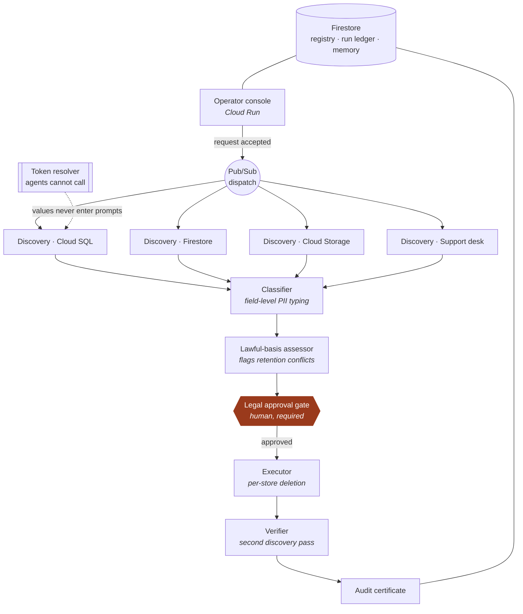

# Custodian — architecture

> Status: build spec, not a description of what exists. Sections marked
> **planned** are not implemented yet. See README for what is verified.

Custodian executes data-subject requests across production data stores: it
discovers where a person's data lives, assesses what may lawfully be deleted,
routes the decision to a human with authority, executes, and proves what it did.

The design problem is not "can an agent delete a row." It is doing something
irreversible, to production data, about a real person, under a statutory clock,
without a model ever holding personal data.

## Fleet topology

## The confinement rule

One rule constrains everything else: **no agent prompt may contain a personal
data value.**

Discovery agents receive schema metadata, column statistics and match evidence
expressed as opaque tokens. When an agent needs to reason about whether
`customers.email_alt` holds the subject's address, it sees a token identity, a
field type, and a match score — never `someone@example.com`. Raw values resolve
only inside the executor, through a resolver the agents have no tool binding to
and no service-account permission to reach.

This is what makes the fleet safe to point at production, and it is the claim the
demo has to make visible rather than assert.

## Mapping to the Fortified Enterprise Fleet requirements

The track names five components. Each maps to a real part of the system rather
than a checkbox:

| Required | Implementation | State |
| --- | --- | --- |
| Agent registry for cross-departmental discovery | Firestore catalog: capabilities, owning department, permitted data scopes, approval requirements | in progress |
| Runtime environment | Cloud Run service (console) + Cloud Run jobs (fleet), Pub/Sub dispatch | planned |
| Persistent memory | Firestore run ledger, per-store data map that improves across runs | planned |
| Security controls | Confinement rule above; per-agent service accounts; mandatory human gate before any irreversible action | planned |
| Observability (OpenTelemetry) | ADK ships OTel; exported to Cloud Trace, fan-out visible as parallel spans | in progress |

Four departments own agents in the registry — Data Engineering, Security, Legal,
Support — which is what makes catalog discovery meaningful rather than a list of
one team's scripts.

## Why each Google Cloud service is here

Nothing in this list is present to satisfy the rules; each earns its place.

- **Cloud Run** — the console, plus one job per discovery agent. Scale-to-zero
  matters because runs are bursty and rare.
- **Pub/Sub** — decouples request intake from discovery. This is what makes the
  work genuinely asynchronous; without it the demo is a blocking request.
- **Firestore** — registry, run ledger, audit trail, accumulated data map. Its
  document model fits an append-only event log per run.
- **Cloud SQL** — a realistic relational store to search, and the one place
  deletion has referential consequences worth demonstrating.
- **Cloud Storage** — unstructured documents, where discovery is hardest.
- **Vertex AI / Gemini 3.5** — classification and lawful-basis reasoning.

## Known risks

- **Fan-out too fast to read.** Parallelism that completes in under two seconds
  reads as a single step on video. Stagger seeded workloads rather than faking
  latency.
- **The confinement rule is easy to leak.** Any convenience path that puts a raw
  value into a prompt destroys the central claim. Enforce it with a test that
  scans outbound prompts.
- **Scope creep into a platform.** Custodian is one request type — erasure —
  against four seeded stores. Access requests, policy authoring and connectors
  are explicitly out.
